# PR曲線による平均適合率の計算について、自分で書いて確認してみる
  

この記事では、物体検出を行ったときの精度の指標である、平均適合率について扱います。

この記事を執筆するにあたって、原田達也先生の「画像認識」の7.7.2 平均適合率を参考にいたしました。詳しくはこの本をご参照ください。

[https://www.amazon.co.jp/dp/B0756V3TPG/ref=dp-kindle-redirect?_encoding=UTF8\&btkr=1](https://www.amazon.co.jp/dp/B0756V3TPG/ref=dp-kindle-redirect?_encoding=UTF8&btkr=1)

# はじめに

ここでいう物体検出とは、以下の図のように、画像中から関心のある物体を検出することです。検出された物体は黄色の箱（以下、**バウンディングボックス**という）で囲まれていることがわかります。また、下の図では、あえて少し車の領域からずらしてバウンディングボックスを作成しています。

　これを検出結果だとすると、この検出の結果を評価するためには、どうのようにすればよいでしょうか。代表的な物体検出の評価として、**平均適合率**によるものが挙げられます。この記事では、この平均適合率について勉強したことをまとめます。

この記事は以下のような構成になっています。

   1.  **前半部分**：平均適合率についての説明 
   1.  **後半部分**：前半部分の理解が正しいかを確かめるために実際に自分で実装してみる 

2の部分でも、公式の関数と比べて、おおよそ正しい値が出ているので、大きな間違いはないとは思うのですが、私の理解違いやわかりにくい部分もあるかもしれません。その場合は教えていただけますと幸いです。

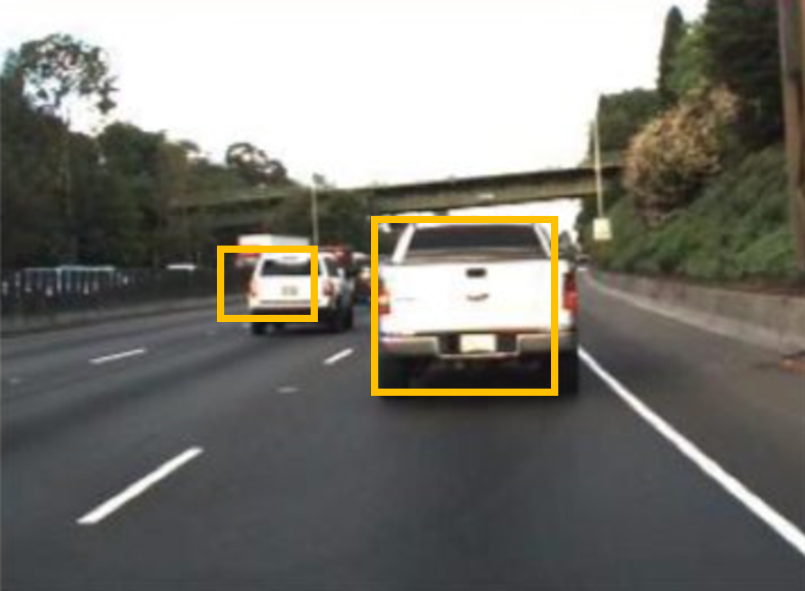

画像出典：[What Is Object Detection? 3 things you need to know](https://jp.mathworks.com/discovery/object-detection.html) (以下も同様）

# 物体検出の評価をするときの準備

物体検出の性能を評価するためには、まず、正解となるバウンディングボックスの情報が必要です。下の図では赤色のバウンディングボックスで示されています。

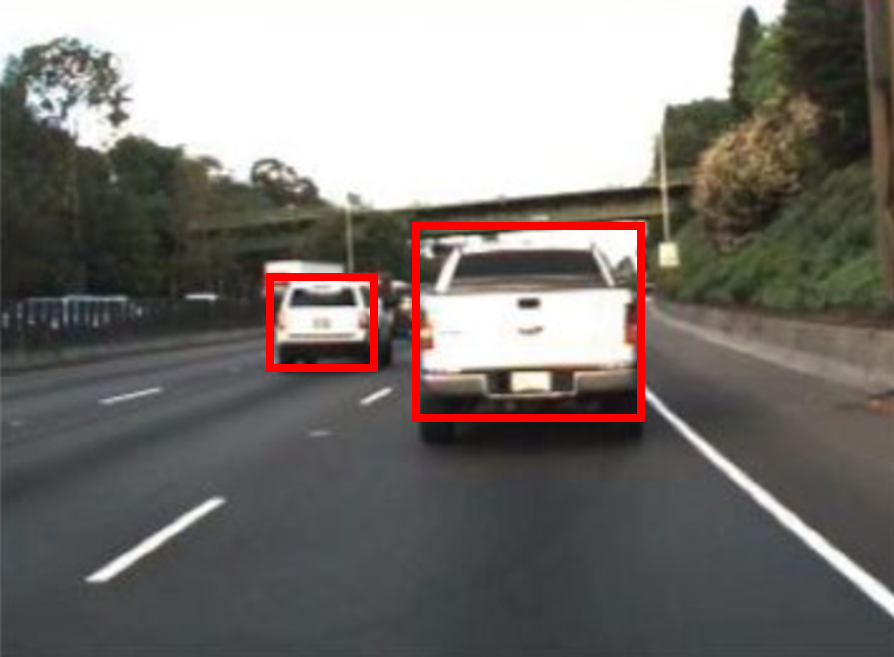

はじめに示した、検出の結果（黄色のバウンディングボックス）と比べると、より車の領域を正しく捉えられていることがわかります。

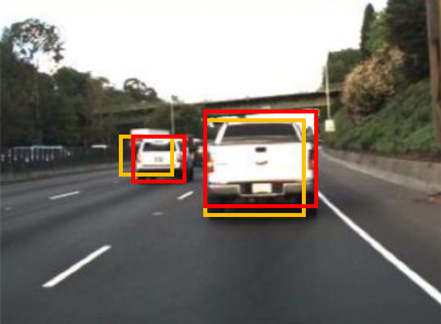

このように、平均適合率では、正解データとしてのバウンディングボックスと、検出の結果としてのバウンディングボックスを比べ、計算していきます。

# IoUについて

上の図では、２つの自動車を検出していて、どちらの検出も正しく行えていそうです。ただ、以下の例のように、検出結果（黄色）が、正解のバウンディングボックス（赤）に比べて、非常に小さかったり、横方向にずれていると、この検出結果は正しくないように見えます。

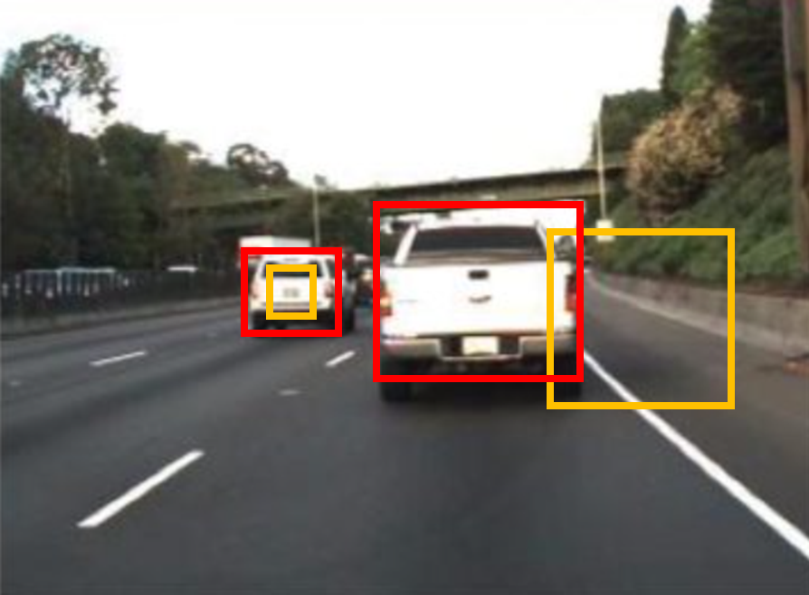

ここで、**`IoU`** (Intersection over Union)と呼ばれる指標を導入します。図示すると下のようになります。IoUは、正解と予測のバウンディングボックスの共通の重なり部分を、2つのバウンディングボックスを重ねたときの総面積で割り算したときの結果を指します。一般的には、このIoUの値が0.5以上だと正しく検出ができたとみなす場合が多いです。ただ、その時々の要求精度や、扱う物体によっては、0.5以外が良い場合もあるかもしれません。この値を他の値にすれば、もちろん後に計算する平均適合率の値も変化します。

  

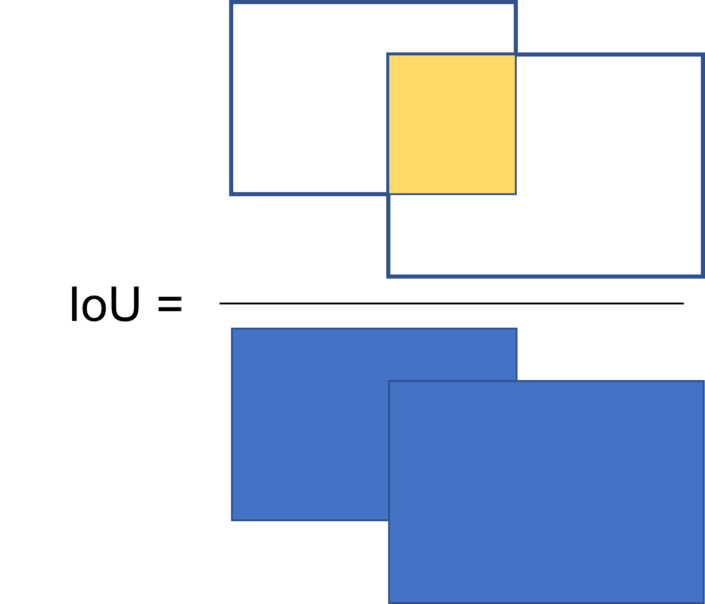

# recall/precisionについて

上で説明したIoUに加え、**`recall`**や**`precision`**といった指標も必要になってきます。recallとprecisionについては、以下の記事などがわかりやすかったです。詳細については以下に示した、他の方の記事をご覧になってください。

平均適合率の計算で考えるべきこととして、

   1.  検出器が自動で検出した物体が、実際にその物体であると嬉しい（ここに犬がいる、といって、実際にその領域に犬が存在していると嬉しい） 
   1.  その画像に犬が5匹いたとすると、漏れなく5匹全て検出されると嬉しい 

ということです。1のような、検出の結果が正しく犬を言い当てている、ということの大事さは想像することが容易です。ただ、正しかったらそれでいいだけでなく、2のように、その画像に存在する犬を、漏れなく発見することも大事です。

そのため、この平均適合率において重要な指標が2つあって、

   -  **recall**：すべての正解のバウンディングボックスのうち、何個（何％）検出できたか 
   -  **precision**：検出したバウンディングボックスのうち、何個（何％）が正しいか 

ということなのではないかと個人的には思います。

**分類のための指標(PrecisionとRecall)の解説**https://engineering.mobalab.net/2020/12/03/%E5%88%86%E9%A1%9E%E3%81%AE%E3%81%9F%E3%82%81%E3%81%AE%E6%8C%87%E6%A8%99precision%E3%81%A8recall%E3%81%AE%E8%A7%A3%E8%AA%AC/

**Precision, Recall, F値の気持ちを解釈してみる**

[https://qiita.com/dl_from_scratch/items/4efdf647b397d794cd67](https://qiita.com/dl_from_scratch/items/4efdf647b397d794cd67)

  
# スコアについて

物体検出のアルゴリズムにはスコアと呼ばれるような、その検出の信頼度を表す値を伴うことが多いです。感覚的に述べると、「○○%の確率でここにAという物体がある」といった感じです。平均適合率の計算では、スコアについてはこれくらいの認識で問題ないと思います。

# バウンディングボックスの位置と大きさの表し方

**バウンディングボックスの位置と大きさは、4つの値によって表すことができます。**

例えば、`[左上の角のx座標、y座標、ボックスの縦の長さ、横の長さ]`というルールでバウンディングボックスを定義できます。

以下のコードで画像にバウンディングボックスを描き入れることができます。`position`という変数でバウンディングボックスの位置と大きさを定義しています。60が横幅、40が高さを示しています。

```matlab:Code
im=imread('onion.png');
% =================
% この4つの値でバウンディングボックスの位置と大きさを設定できる
position=[121 5 60 40];
% =================
im_with_bbox=insertObjectAnnotation(im,'rectangle',position,'onion','TextBoxOpacity',0.9,'FontSize',10);
figure;imshow(im_with_bbox)
```

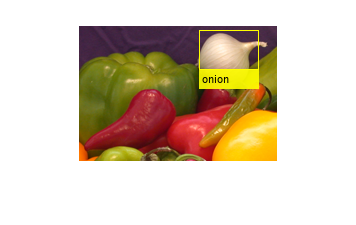

# 予測したバウンディングボックスと正解データからの平均適合率の計算

これまでのポイントとしては、

   -  IoU（ボックスの重なり具合）で検出の確からしさを評価できる 
   -  検出の際には、多くの場合、スコア（検出自体の確からしさ）が付与される 
   -  検出においては、その検出が正しいか (**precision**)ということと、対象となる物体が漏れなく検出されているか (**recall**)という指標が大事である 
   -  バウンディングボックスの位置と大きさは左上の隅のx, y座標および縦横の長さの4つの値で表せる 

ということでした。何となくこれらの指標やポイントを組み合わせて、検出の評価ができそうな気がしてきました。

次はその具体的な計算の手順について考えていきます。

## 1) 検出したバウンディングボックスの位置と大きさ、正解のバウンディングボックスの位置と大きさ、検出したバウンディングボックスのスコアを表にまとめる

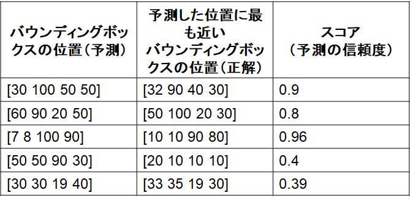

## 2) 1)で用意した表を、スコアに対して並び替え（高いもの順）

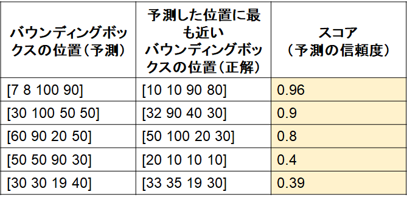

## 3) 2)の表に対して、IoUの基準（例：0.5）を設定し、正解かどうか判定

ここで、IoUは厳密に計算しておらず、仮に4つ目の検出のみ不正解であったとします。

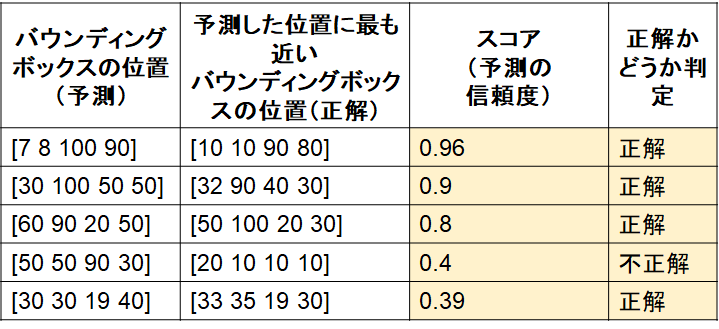

## 4) recallとprecisionの計算

注意）ここでは、2値分類の時のrecall/precisionをそのまま当てはめて考えると少し混乱するかもしれません。以下の説明のように考えていただけると幸いです。

**4-1 recallについて**

この画像中に正解のバウンディングボックスが5個あったとします（つまり対象の物体が5個）。そのうち、今回は4つが正しく検出されています。その場合、表の上から、recallを1/5, 2/5, 3/5, 3/5, 4/5とします。**この分母は、その画像中に含まれる物体の正解数**です。検出器が検出した件数ではありません。3/5が2回続いていいますが、これは4番目が不正解の検出であったため、recallとしてカウントされていません。

**4-2 precisionについて**

この表の上から順番に、物体検出の問題の回答としてオープンしていくことを考えます。すると、1行目に関しては、はじめて回答した答えが正解したので 1/1, 2行目に関しても2つ回答して、2つとも正解なので2/2, 3つ目も同様に3/3, 4つ目は不正解なので3/4です。そして5つ目は正解しているので4/5ということになります。

## 5) 4で計算した、recallとprecisionをそれぞれ、x・y軸の値としてプロットする

```matlab:Code
recall=[0,1/5, 2/5, 3/5, 4/5, 4/5];
precision=[1,1/1, 2/2,3/3,3/4,4/5];
figure;plot(recall,precision,'b--o','MarkerFaceColor','b')
```

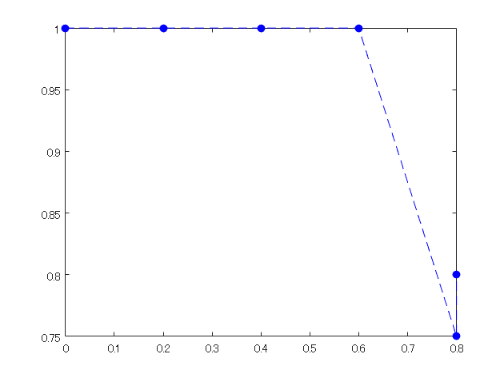

## 6) 5)の下側の領域の面積を計算する

この面積を平均適合率とします

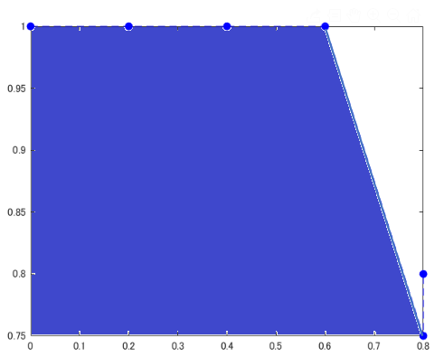

# 補足
## 1) 右側での最大値での置き換え

以下の図のように、不正解＝＞正解という順番があって、途中でprecisionの値が向上したときは、水色の三角のように、値を大きくして補間することを行います。別の言い方をすると、各点に対して、右側の領域のもっとも大きい値で置き換えをしています。

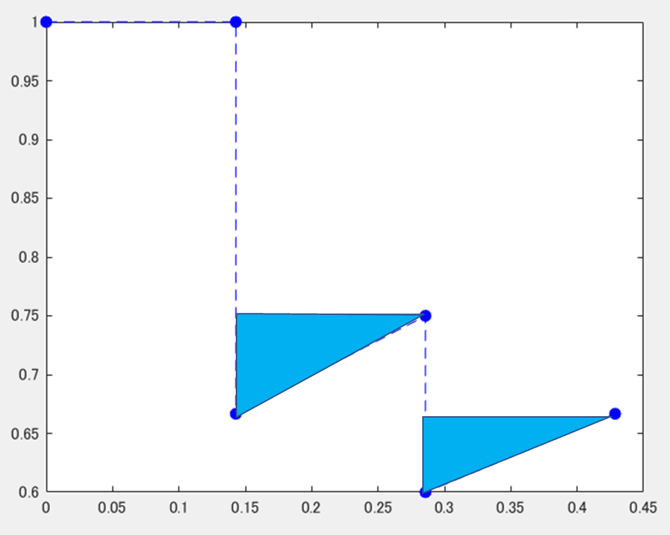

## 2) サンプリングによる近似

以下の式のように、平均適合率を近似した形で求める場合もあるようです。ここでは、11の領域に分割し、0, 0.1, 0.2といった間隔でprecisionの値を見ます。そのときのprecisionの値をその区間の代表値として11個分足し合わせていきます。


## 3) mAPについて

各クラスに関して、上の平均適合率を計算し、その平均をとったものを**mean Average Precision (mAP)**という

# 平均適合率についておさらい

以上のような方法で、PR曲線を描き、その面積を求めることで平均適合率を求めることができました。

おさらいのために、どのような場合に平均適合率が大きくなるかをrecall, precisionに分けて考えていきます。

   -  recall について：PR曲線の下の面積が高いほど平均適合率が高い（検出の精度がよい）。ということは、recallも右側まで伸びている（つまり1に到達できる）場合に平均適合率が高くなる。しかし、むやみにたくさん検出すると次の箇条書きのprecisionが下がってしまう 
   -  precisionについて：同様に、PR曲線の下側の面積を大きくするためには、縦の高さが大きい方がよい。正しく検出する場合に、precisionが大きくなる。自信のあるものだけを検出するようにすればprecisionも高くなるが、その場合は前の箇条書きのrecallが下がってしまう。 

recall, precisionともに検出において重要な指標ですが、どちらかのみを高くしようとするともう片方が下がってしまうので、両方高くなるような検出、つまり正解データとほぼ同じ検出ができるとよい、ということがわかります。

　このように簡単にですが、平均適合率についてまとめてみました。次に実際に自分で簡単なものを実装してみて、上の理解が正しいか確認したいと思います。

# 後半部分：自分で簡単に実装してみる
## 1 MATLABの公式の関数で平均適合率を計算する

まずは、正しい値を得るために、MATLABで公式にサポートされている関数にて平均適合率を計算します。

用いた例題は以下のページにあります。

https://jp.mathworks.com/help/deeplearning/ug/object-detection-using-yolo-v2.html

データは、この例題を実行したときの評価に用いるデータを使います。ここでは、そのときのデータをそのまま保存しているのではなくて、table変数で保存し、dataフォルダーに格納しています。table変数にすることでワークスペースから値の確認が簡単になります。

```matlab:Code
clear;clc;close all
% 閾値の設定：IoUが0.5を越えると、「正しい」検出であると判断する
thresh=0.5; % threshold over which the detection is judged as "correct"
all_score=[];
% 公式ドキュメントの例題で用いているデータをロードする
load groundTruth.mat
load detectionResults.mat
```

`evaluateDetectionPrecision`関数を用いて、`平均適合率`や、`recall`, `precision`を計算します。

```matlab:Code
[ap,recall_matlabFunc,precision_matlabFunc] = evaluateDetectionPrecision(detectionResults, groundTruth, 0.5);
ap
```

```text:Output
ap = 0.7712
```

PR曲線のプロット

```matlab:Code
figure;plot(recall_matlabFunc,precision_matlabFunc);title('PR curve')
```

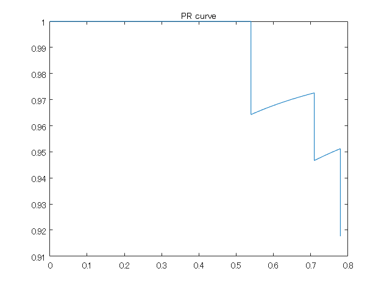

このようにここで用いているデータの平均適合率は約0.77でした。以下のように実際で実装してみて、おおよそこの値になることを目指します。

```matlab:Code
numel(recall_matlabFunc)
```

```text:Output
ans = 86
```

ここで、recallのサイズは86であることがわかります。この値は次のセクションで確認のため用います。

## 予測した検出、および正解の検出のデータの件数をカウントする

さきほどロードした、detectionResultsとgroundTruthという変数がそれぞれ予測した検出の結果、および正解のデータになっています。それぞれ、いくつの検出数があるか確認してみます。

```matlab:Code
num=0;
for i=1:size(detectionResults,1)
    scoreAll=detectionResults(i,2);
    scoreAll=numel(scoreAll.Scores{1});
    num=num+scoreAll;
end
num
```

```text:Output
num = 85
```

検出した結果をみると、85個の検出結果があることがわかります。recallのサイズは86でした。確かに、recallのサイズは検出したバウンディングボックスの数＋１であることがわかります。　＋１というのは、recallが0から始めるためです。

次に、正解データ（変数名はgroundTruth）のバウンディングボックスの数を数えます。

```matlab:Code
numgt=0;
gt_vehicle=groundTruth.vehicle;
for i=1:size(groundTruth,1)
    gt_i=gt_vehicle{i};
    numgt=numgt+size(gt_i,1);
end
numgt
```

```text:Output
numgt = 100
```

この結果が示すように、正解データのバウンディングボックスの数は100個であることがわかります。

MATLABの公式の関数で計算した、recallの値であるrecall_matlabFuncを参照すると、recallの幅は、0.01（つまり1/100)の間隔で増えていっていることがわかります。つまり、正解が100個あるので、その100という数を全体として、1つ検出するごとに0.01増えていくことになります。

```matlab:Code
recall_matlabFunc(1:5)
```

```text:Output
ans = 5x1    
         0
    0.0100
    0.0200
    0.0300
    0.0400

```

一方、81番目から84番目のrecallを表示させてみます。

```matlab:Code
recall_matlabFunc(81:84)
```

```text:Output
ans = 4x1    
    0.7600
    0.7700
    0.7800
    0.7800

```

このように、0.78が2回続きます。これは、84番目の検出が不正解（IoUが0.5以下）なので、recallとして認定されず、recallが増加していないことを示しています。

## FOR文にて、各検出されたバウンディングボックスが正しいか判断する

各画像に紐づいたバウンディングボックスとその正解データ、そのときのscoreを抽出し、IoUを計算します。

画像の中でもさらに複数のバウンディングボックスがあるため、for文が2つ組み込まれています。

```matlab:Code
bbox_ind=1; % index of bounding box
for i=1:size(detectionResults,1)
    bboxes=detectionResults(i,1); % retrieve bounding boxes in i-th image
    bboxes_i=bboxes.Boxes{1}; % cell2table
    scores=detectionResults(i,2); % scoreを追加
    scores_i=scores.Scores; 
    if size(bboxes_i,1)>0
        for j=1:size(bboxes_i,1)
            bbox_i=groundTruth.vehicle;
            bboxes_j=bboxes_i(j,:);
            score_j=scores_i{1};
            catb=cat(1,bbox_i{i});
            % calculate iou
            overlapRatio = bboxOverlapRatio(bboxes_j,catb,'Union');
            overlapRatioMax = max(overlapRatio);
            if overlapRatioMax > thresh
                all_score(bbox_ind)=score_j(j);
                iscorrect(bbox_ind)=1;
            else
                all_score(bbox_ind)=score_j(j);
                iscorrect(bbox_ind)=0;
            end
                bbox_ind=bbox_ind+1;
                
        end
    end

end
```

## recallとprecisionを計算

バウンディングボックス自体は存在しても、そのIoUが0.5未満だと正解だとみなされないため注意が必要です。

```matlab:Code
recall=0; % initialization of recall
precision=1;% initialization of precision
[all_score,scoreInd] = sort(all_score,'descend'); % sort score
iscorrect=iscorrect(scoreInd); % sort by score
for k=1:bbox_ind-1
    % see iscorrect to check if the i-th bbox is correct
    if iscorrect(k)==1
        recall(k+1)=recall(k)+1/numgt;
        precision(k+1)=sum(iscorrect(1:k)/k);
    else
        recall(k+1)=recall(k);
        precision(k+1)=sum(iscorrect(1:k)/k);
    end
end
figure;plot(recall,precision);
```

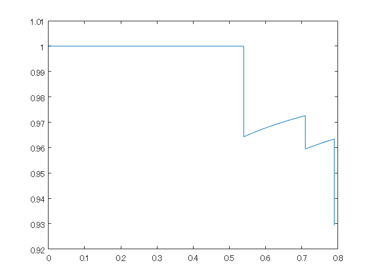

## 平均適合率を計算

MATLABの公式の関数で計算したときの値とおおよそ合致していることがわかります。

※補足にて説明した、右側での最大値での置き換えは行っていません。

```matlab:Code
v=1;ap=0;
for l=1:numel(precision)-1
    precision_i=precision(l);
    ap=ap+(recall(l+1)-recall(l))*precision_i;
end
ap
```

```text:Output
ap = 0.7816
```

# まとめ

   -  この記事では、PR曲線から平均適合率を計算する手順について説明しました 
   -  前半では平均適合率を計算する方法について説明しました 
   -  後半では、実際に自分で簡単に実装してみて、MATLABの公式の関数で計算された値とおおよそ一致することを確かめました 
   -  もし間違いやご質問などがございましたら、ご連絡いただければ幸いです
